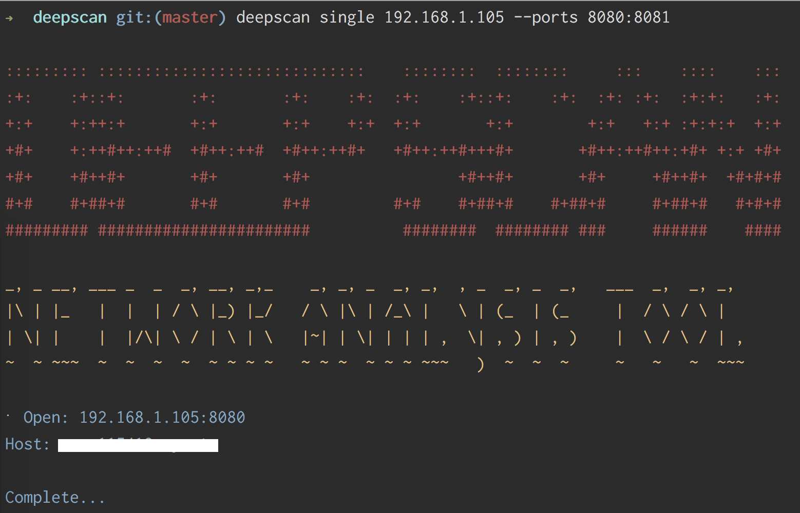

# Deep Scan



Deep scan is a highly performant network analysis tool. Deep scan can scan an ip range, and a port range to find open ports, active ip's and host names on a given network. 

The tool can be utilised in deep scan mode, which will scan an IP range, and a port range. Or focus mode, which will target a single IP address.

Deep scan is highly concurrent and will utilise all available cores, making deep scan highly performant.

## Installation

```
$ go get github.com/EwanValentine/deepscan
```

## Usage

### Scan a single host

This will scan a single host, with a port range of 8000 to 9000.
```
$ deepscan 192.168.0.1 --ports 8000:9000
```

### Multiple hosts
This will scan every IP in a given CIDR block, with a port range of 1000 to 2000.
```
$ deepscan 192.168.1.1/24 --ports 1000:2000
```


### 
- Make scanners modular and interchangeable
- Create concept of attackers to perform actions on results (modular approach)